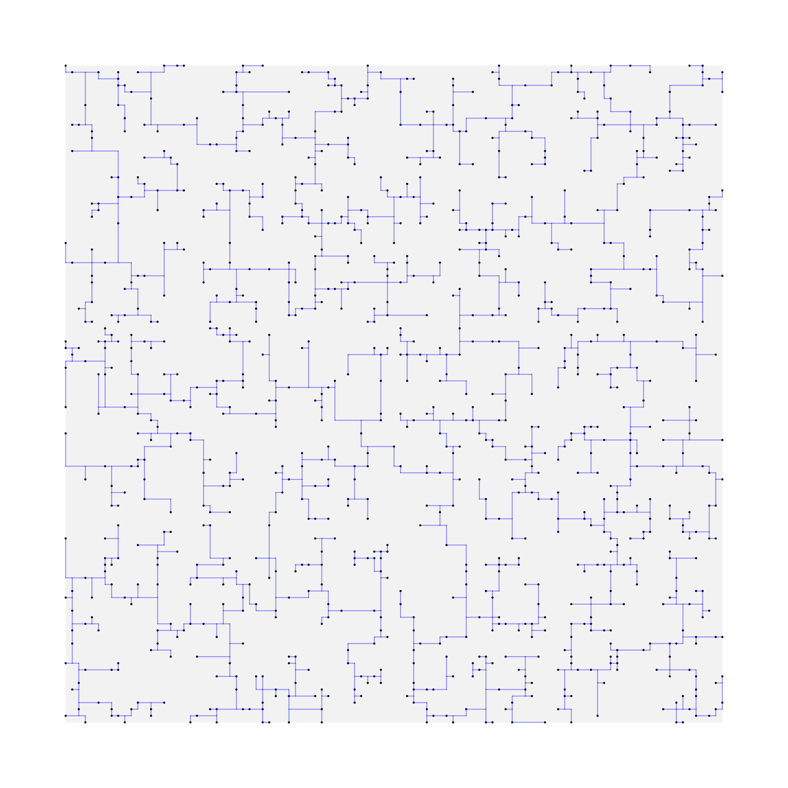
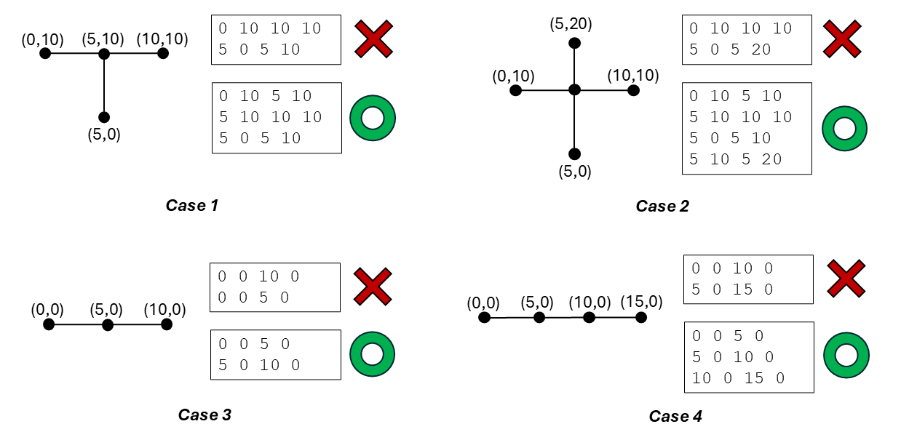

## Problem: Rectilinear Steiner Tree
Given a set of 2D nodes and a rectanguler boundary, generate a rectilinear Steiner tree constrained within the boundary. The objective is to minimize the total length of the tree.


### Input
The input format is defined as follows.
* The first line specifies the boundary with four integers: `xl` (lower x), `yl` (lower y), `xh` (upper x), and `yh` (upper y).
* The second line specifies the number of nodes `n`, followed by the coordinates (`x y`) of each node on separate lines.
#### Input Format
```
[boundary_xl] [boundary_yl] [boundary_xh] [boundary_yh]
[node_count]
[x1] [y1]
[x2] [y2]
...
[xn] [yn]
```
#### Input Example
```
0 0 10 10
3
5 0
0 5
10 10
```
#### Input Size
* 0 $\leq$ boundary_xl $\leq$ boundary_xh $\leq$ 10,000
* 0 $\leq$ boundary_yl $\leq$ boundary_yh $\leq$ 10,000
* 0 $\leq$ node_count $\leq$ 10,000

### Output
The output format is defined as follows.
* The first line specifies the number of edges `m` in the Steiner tree, followed by the edges on separate lines.
* Each edge is represented by four integers: `x_1 y_1 x_2 y_2`, indicating an edge from `(x_1, y_1)` to `(x_2, y_2)`.
#### Output Format
```
[edge_count]
[e1_x1] [e1_y1] [e1_x2] [e1_y2]
[e2_x1] [e2_y1] [e2_x2] [e2_y2]
...
[em_x1] [em_y1] [em_x2] [em_y2]
```
#### Output Example
```
4
5 0 5 5
0 5 5 5
5 5 5 10
5 10 10 10
```

### Connectivity Definition
* A node is considered connected to an edge if and only if it is an endpoint of that edge.
* To ensure a valid Steiner tree, any two edges may intersect only at a single shared endpoint.


## Compilation
* Ensure that the `-O3` optimization flag is used in the `Makefile`.
* All source code must be placed under the `src/` directory.
* Sample code is provided; you may use it as-is, modify it, or ignore it based on your preference.
* Ensure that the compilation generates a binary named `steiner` under the `bin/` directory.

You can run all inputs in the /input folder using
```
./run_all.sh
```
You can generate new inputs manually or using the generate_nodes.py file.


## Platform
* Language: C/C++

## Checker
A checker binary is provided under the `checker/` directory to check your output.

Usage:
```
./checker/checker <input_file> <output_file>
```
Example:
```
./checker/checker input/sample_1.txt output/sample_1_out.txt
```

## References
1. Chris Chu and Yiu-Chung Wong. "FLUTE: Fast lookup table based rectilinear Steiner minimal tree algorithm for VLSI design." IEEE Transactions on Computer-Aided Design of Integrated Circuits and Systems 27, no. 1 (2007): 70-83.
2. Hai Zhou. "Efficient Steiner tree construction based on spanning graphs." In Proceedings of the 2003 international symposium on Physical design, pp. 152-157. 2003.
3. Jeff Griffith, Gabriel Robins, Jeffrey S. Salowe, and Tongtong Zhang. "Closing the gap: Near-optimal Steiner trees in polynomial time." IEEE Transactions on Computer-Aided Design of Integrated Circuits and Systems 13, no. 11 (1994): 1351-1365.
4. C. Hsu, “CHENHAOHSU/Sp25_VLSI_CAD_Steiner_Tree: ECE 382M VLSI CAD & optimization - homework 3,” GitHub, https://github.com/ChenHaoHSU/Sp25_VLSI_CAD_Steiner_Tree  
